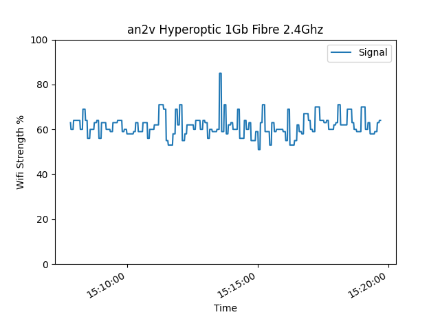

# Check Yo WiFi

I got frustrated at the instability of the WiFi signal at my place. 
This program helps track your WiFi signal over a period of time and plots a chart to show you how 
it performed.

An option to track receive and transmit data in Mbps is also available. Here is an example chart of my flaky annoying WiFi:

Some other features to add in the future:
- Add moving average
- Windows support only at the moment, will add MacOs and Linux too soon. 